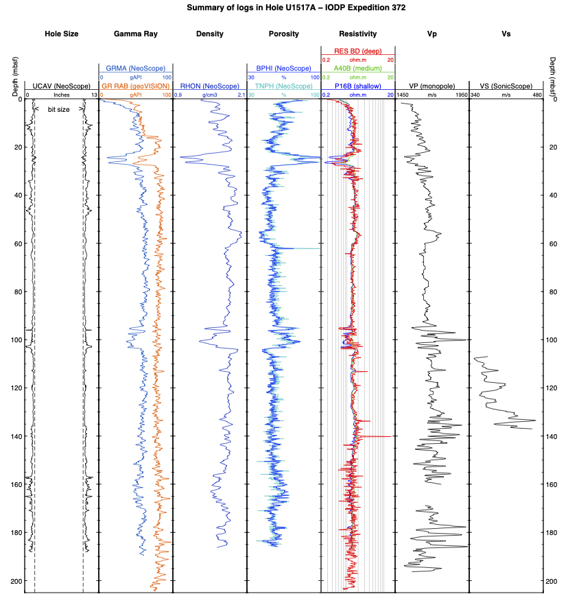
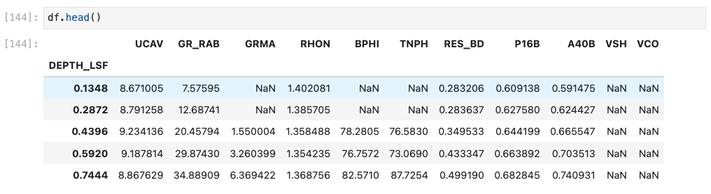

# GPGN268 - Geophysical Data Analysis
## Data Story 01 - Well Logging
#### Due: March 9, 2023 at 9:30 am

For this data Story you will look at well-logging data from the [International Ocean Discovery Program](https://www.iodp.org/). You already have some data from two expeditions in your `ds01-well-log` folder, but you're welcome to explore other datasets [here](https://mlp.ldeo.columbia.edu/logdb/) if you'd like. We will be primarily working with data from expedition **372A** hole **U1517A**. 

You may discuss this assignment with your peers, but everyone should submit their assignment individually. If there is anyone who has *signficantly* contrbuted to your work, helped you figure something important out, etc., list them as a collaborator below with a short description of their input. **Collaborating will not impact your grade**. Please be honest.

Your ultimate goal will be to reproduce and analyze the summary plot below. You know how to plot, but you might not know everything you need to reproduce this plot just yet. That is OK! Figuring out how to do things in your own is one of the learning outcome of this course. If you fell stuck, here are a few options:

- Research! Read the matplotlib documentation, google "matplotlib + what you're trying to do", etc.
- Ask a peer
- Create a post in the GitHub discussions with your question
- Ask me or Seunghoo



### Preparation

- Navigate to your `ds01-well-log` directory and launch Jupyter Lab. Remember to activate conda first if you are using Gitbash.

```
$ cd ~/work/classes/GPGN268/coursework-lastname/ds01-well-log/
$ jupyter lab
```

- Using the left navigation toolbar in Jupyter Lab, go to the `notebooks` directory and create a new jupyter notebook called `dev.ipynb`– this will be where you will develop the code for your data story (try things out, make draft figures, etc). **You will not** turn in (i.e., push to GitHub) the `dev.ipynb` file. 

- Create another notebook called `ds01-well-log.ipynb`. This is where you will put the final version of your Data Story, with polished text, and clean and well-documented code.

- Copy the text below onto the first cell (Markdown) of your `ds01-well-log.ipynb` notebook and fill it out with your name and date.

```markdown
# GPGN268 - Geophysical Data Analysis
## Data Story 01 - Well Logging

**Student:** Blaster the Burro 
**Collaborators:**
- Yoda helped me figure out how to use the force
- Obi-Wan provided input on my code to plot resistivity
**Date:** May the 4th, 2078
```

- Complete the tasks below. Use your `dev.ipynb` notebook to explore and try things out. After your are done with the final version of your assignment, git add `ds01-well-log.ipynb`, commit, and push to GitHub.


### Task 1. Introducing your story. 

Read the [Proceedings](http://publications.iodp.org/proceedings/372A/372Atitle.html) of expedition 372A, especially the [Expedition 372A summary](http://publications.iodp.org/proceedings/372A/EXP_REPT/CHAPTERS/372A_101.PDF).Using the resources above and any other material that comes up on your research, write a couple of paragraphs introducing your Data Story. Some questions to keep in mind are:

- What is well-logging? 
- What data are you going to be looking at and where did it come from?
- What are these type of data used for? What are some scientific/societal applications of this type of observations? 
- What is usually the format of this data (time series, spatial data, 1D, 2D?)
- What are some common tools used for analyzing and interpreting these type of data?

### 2. Data Cleanup
- Take a first look at some of the files. What format are the data files in? How can you read them?
- What variables are in each file? Are the variable names meaningful? (you might want to check the IODP website for a list of acronyms)
- Look at the titles in each panel in the summary plot and try to locate the respective variables in your data files (using bash to do `$ cat filename | head` might be helpful for that).
- Use `pandas` to read the files, extract the relevant variables (the ones that apear in the summary plot), and concatenate them into a single new DataFrame. Your new DataFrame should look like this:



- Inspect your data. Make some initial plots to visualize each variable, and check the summary statistics (e.g., with histograms, using dataframe.describe() ...). Are there any obviously wrong measurements? If yes, replace those values with NaNs.

- Create a directory to store your processed data and save your concatenated DataFrame as a new `.csv` file there. Create a README.md file for your processed data explaining what processing was done, what each variable is, what units the measurements are in, and any other information that someone would need to make sense of the file that you created.


### 3. Data Analysis

- Use `matplotlib` to reproduce the summary plot as best as you can. 
- More than anything, this will be an exercise on how to find answers to your Python questions. A good starting point is always the official documentation of the library that you are using ([matplotlib](https://matplotlib.org/) in this case). Another great resource is [Stack Overflow](https://stackoverflow.com/). You might try searching "how to add subplot titles in matplotlib", or "how to change tick labels in matplotlib", and so on.
- If this feels a bit overwhelming, you can start by plotting a single variable and tweaking the plot for that one variable. After you figure out how to make a figure with a single panel, then try adding another panel.

### 4. Interpret the data. 
- Write a couple of paragraphs discussing what you see in the data, how the variable are related, and justifying your observations and conclusions.

### 5. Extra
- If this was too easy for you and you wish to get more practice, follow a similar workflow to analyze data from a different expedition.
